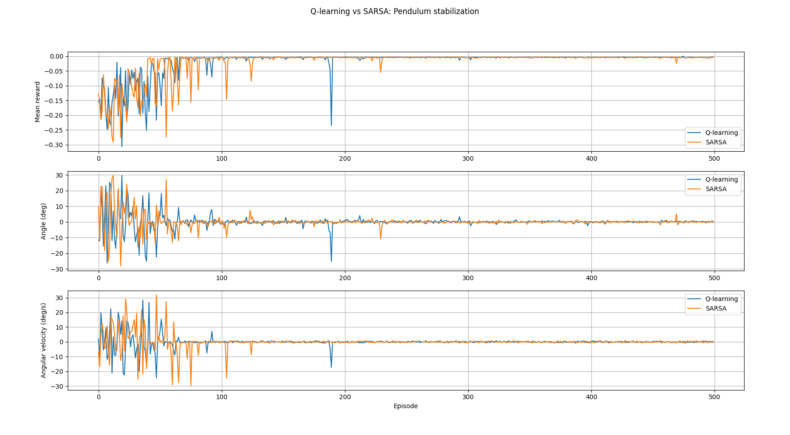

              # Pendulum Stabilization: Q-Learning and SARSA

This project presents a simple reinforcement learning framework to compare **Q-Learning** and **SARSA** algorithms on a classic control problem - **pendulum stabilization**.

The goal is to learn a control strategy that maintains a pendulum in a near-vertical position using only proprioceptive state information (angle and angular velocity).


---

## Environment

The environment models a simplified pendulum with discrete control actions:

- **State**:  
  $s = (\theta, \dot{\theta})$

- **Actions**:  
  $u \in {-1, 0, 1}$  
Which means turn left, stay straight, turn right
- **Reward function**:
  $r = -(\theta^2 + 0.1 \dot{\theta}^2)$

An episode terminates when the pendulum exceeds a predefined angle limit.

---

## Algorithms

Two tabular reinforcement learning algorithms are implemented:

- **Q-learning (off-policy)**
- **SARSA (on-policy)**

---

## Run

1. Create **venv**
```shell
python -m venv venv
```
2. Enter **venv**  
Windows:
```shell
.\venv\Scripts\Activate.ps1
```
Linux:
```shell
source venv/bin/activate
```
3. Install dependencies
```shell
pip install -r requirements.txt
```
4. Train algorithms:
```shell
python -m train
```
5. Show graphs:
```shell
python -m plot
```

## Results

During training, the following metrics are recorded:

- Mean episode reward

- Mean pendulum angle

- Mean angular velocity

  

---
Author

Mikhail Rogalsky  
Master student, Robotics and Artificial Intelligence  
ITMO University, 2026